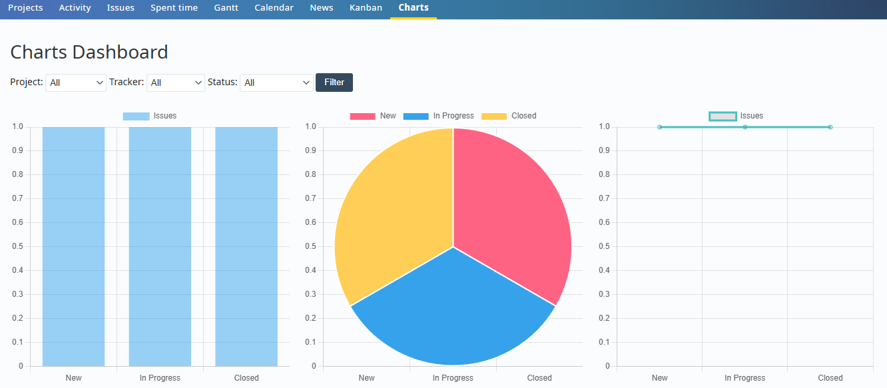

# Redmine Charts Plugin
Tested with Redmine 6.0

This plugin adds charts for projects and issues in Redmine.

## Installation

1. Place the plugin in `plugins` folder.
2. Run `bundle install`.
3. Run `RAILS_ENV=production bundle exec rake assets:precompile`
4. Restart Redmine. (for Apache, `service apache2 restart`)
5. Access the "Charts" menu item in the project menu.

## Features

- Bar, Pie, Line, Radar, Polar Area, and Bubble charts
- Filter by project, tracker, and status

## Contributions

Contributions are welcome! You can add anything new and usefull, for example extend the filters, add new types of charts, etc ...

1. fork the repository
2. bring and test your changes locally
3. leave a PR

